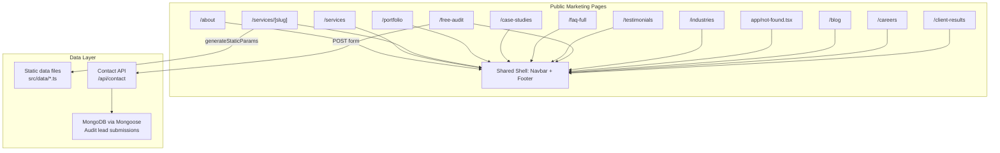
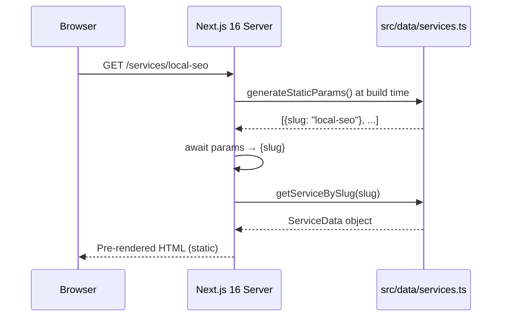
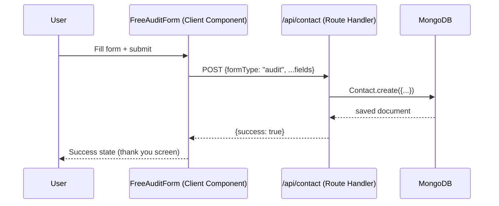

# Design Document: RankVillage Missing Pages

## Overview

RankVillage AI is a Next.js 16 App Router SaaS platform targeting Indian local businesses. The site currently has a home page, pricing, contact, privacy, terms, and an auth-protected dashboard. This feature adds 13 new public-facing pages — covering agency identity, services, portfolio, social proof, lead generation, and content — to complete the marketing site and improve SEO coverage.

All pages share the existing design system: `bg-[#080812]` dark background, purple/blue/cyan gradients, glassmorphism (`glass`, `glass-card`, `btn-glow`, `gradient-text` CSS classes), `lucide-react` icons, and the existing `<Navbar />` / `<Footer />` shell. Pages are Server Components by default; interactive sections are extracted into `"use client"` sub-components following the existing pattern in `contact/page.tsx`.

The implementation uses Next.js 16 App Router conventions: `params` is a `Promise` and must be `await`-ed in async Server Components or unwrapped with `React.use()` in Client Components. The 404 page uses `app/not-found.tsx` (root-level, catches all unmatched routes). Dynamic service pages use `app/services/[slug]/page.tsx` with `generateStaticParams` for build-time static generation.

---

## Architecture



---

## Route Map

| Priority | Route | File | Rendering |
|---|---|---|---|
| HIGH | `/about` | `src/app/about/page.tsx` | Static (Server Component) |
| HIGH | `/services` | `src/app/services/page.tsx` | Static (Server Component) |
| HIGH | `/services/[slug]` | `src/app/services/[slug]/page.tsx` | Static + `generateStaticParams` |
| HIGH | `/portfolio` | `src/app/portfolio/page.tsx` | Static (Server Component) |
| HIGH | `/case-studies` | `src/app/case-studies/page.tsx` | Static (Server Component) |
| HIGH | `/faq` | **already exists** — extend or keep | Static |
| HIGH | `/testimonials` | `src/app/testimonials/page.tsx` | Static (Server Component) |
| HIGH | `/free-audit` | `src/app/free-audit/page.tsx` | Static shell + `"use client"` form |
| HIGH | `/industries` | `src/app/industries/page.tsx` | Static (Server Component) |
| HIGH | `/*` (404) | `src/app/not-found.tsx` | Server Component |
| MEDIUM | `/blog` | `src/app/blog/page.tsx` | Static (Server Component) |
| MEDIUM | `/careers` | `src/app/careers/page.tsx` | Static (Server Component) |
| MEDIUM | `/client-results` | `src/app/client-results/page.tsx` | Static (Server Component) |

> **Note on `/faq`**: `src/app/faq/page.tsx` already exists. It currently renders the shared `<FAQ />` component. It will be extended in-place with additional trust/support questions rather than creating a new route.

---

## Sequence Diagrams

### Service Detail Page Load (Static)



### Free Audit Form Submission



---

## Components and Interfaces

### Shared Page Shell Pattern

Every new page follows this exact pattern (matching `pricing/page.tsx`):

```typescript
// Server Component — no "use client"
import Navbar from "@/components/Navbar";
import Footer from "@/components/Footer";
import type { Metadata } from "next";

export const metadata: Metadata = {
  title: "Page Title | RankVillage AI",
  description: "...",
};

export default function PageName() {
  return (
    <main className="min-h-screen bg-[#080812] overflow-x-hidden">
      <Navbar />
      <div className="pt-16">
        {/* page sections */}
      </div>
      <Footer />
    </main>
  );
}
```

### Reusable Section Components (new, in `src/components/`)

| Component | Purpose | Used By |
|---|---|---|
| `PageHero` | Consistent hero with badge + h1 + subtitle | All new pages |
| `SectionWrapper` | Max-width container + padding + optional grid-bg | All sections |
| `ServiceCard` | Glass card with icon, title, description, CTA link | `/services`, `/about` |
| `StatBadge` | Animated number + label (e.g. "340% Traffic Growth") | Multiple pages |
| `ProcessStep` | Numbered step with icon + description | Service detail pages |
| `FAQAccordion` | Accessible expand/collapse FAQ item | `/faq`, service pages |
| `TestimonialCard` | Client photo, name, business, rating, quote | `/testimonials` |
| `CaseStudyCard` | Before/after metrics, client logo, summary | `/case-studies` |
| `PortfolioCard` | Screenshot, tech stack badges, live link | `/portfolio` |
| `IndustryCard` | Industry icon, name, use-cases list | `/industries` |
| `AuditForm` | Lead-gen form with `"use client"` | `/free-audit` |
| `BlogCard` | Thumbnail, category badge, title, excerpt | `/blog` |
| `CareerCard` | Role, type (remote/hybrid), apply CTA | `/careers` |

### PageHero Interface

```typescript
interface PageHeroProps {
  badge?: string;           // e.g. "About Us"
  badgeIcon?: LucideIcon;
  title: React.ReactNode;   // supports <span className="gradient-text">
  subtitle: string;
  cta?: {
    label: string;
    href: string;
    variant: "primary" | "secondary";
  };
}
```

### ServiceCard Interface

```typescript
interface ServiceCardProps {
  icon: LucideIcon;
  title: string;
  description: string;
  href: string;             // e.g. "/services/local-seo"
  features: string[];       // 3-4 bullet points
  color: "purple" | "blue" | "cyan" | "pink";
}
```

### AuditForm Interface (Client Component)

```typescript
interface AuditFormData {
  name: string;
  email: string;
  phone: string;
  websiteUrl: string;
  businessType: string;
  city: string;
  auditType: "seo" | "speed" | "full" | "strategy-call";
  message: string;
}

// Submitted to existing /api/contact with formType: "audit"
```

---

## Data Models

### Static Data: `src/data/services.ts`

All service page content is static (no DB). Defined as a typed constant array:

```typescript
export interface ServiceData {
  slug: string;             // URL segment, e.g. "local-seo"
  title: string;
  tagline: string;
  description: string;
  icon: string;             // lucide-react icon name
  color: "purple" | "blue" | "cyan" | "pink" | "green" | "orange";
  heroStats: Array<{ value: string; label: string }>;
  benefits: Array<{ icon: string; title: string; description: string }>;
  process: Array<{ step: number; title: string; description: string }>;
  faqs: Array<{ question: string; answer: string }>;
  results: Array<{ metric: string; value: string; client: string }>;
  relatedServices: string[]; // slugs
}

export const SERVICES: ServiceData[] = [
  { slug: "web-development",        title: "Web Development", ... },
  { slug: "seo-services",           title: "SEO Services", ... },
  { slug: "local-seo",              title: "Local SEO", ... },
  { slug: "technical-seo",          title: "Technical SEO", ... },
  { slug: "google-ads",             title: "Google Ads", ... },
  { slug: "meta-ads",               title: "Meta Ads", ... },
  { slug: "ui-ux-design",           title: "UI/UX Design", ... },
  { slug: "ecommerce-development",  title: "E-commerce Development", ... },
  { slug: "website-maintenance",    title: "Website Maintenance", ... },
];
```

### Static Data: `src/data/portfolio.ts`

```typescript
export interface PortfolioProject {
  id: string;
  title: string;
  client: string;
  category: "web" | "ecommerce" | "seo" | "local-seo" | "ui-ux";
  industry: string;
  thumbnail: string;        // /public/portfolio/...
  liveUrl?: string;
  techStack: string[];
  results: Array<{ metric: string; value: string }>;
  description: string;
}
```

### Static Data: `src/data/case-studies.ts`

```typescript
export interface CaseStudy {
  id: string;
  slug: string;
  clientName: string;
  industry: string;
  logo?: string;
  challenge: string;
  solution: string;
  metrics: {
    trafficGrowth: string;   // e.g. "+340%"
    rankingImprovement: string;
    lighthouseScore: string;
    revenueImpact?: string;
    timeframe: string;
  };
  testimonial?: {
    quote: string;
    author: string;
    role: string;
  };
}
```

### Static Data: `src/data/testimonials.ts`

```typescript
export interface Testimonial {
  id: string;
  name: string;
  role: string;
  business: string;
  city: string;
  rating: 1 | 2 | 3 | 4 | 5;
  quote: string;
  avatar?: string;
  logo?: string;
  videoUrl?: string;
  service: string;          // which service they used
}
```

### Static Data: `src/data/industries.ts`

```typescript
export interface Industry {
  slug: string;
  name: string;
  icon: string;             // lucide-react icon name
  description: string;
  useCases: string[];
  stats: Array<{ value: string; label: string }>;
  color: string;
}

// Industries: restaurant, dairy, real-estate, coaching, retail,
//             medical, gym, hotel, automobile, salon
```

### MongoDB: Extended Contact Model

The existing `Contact` model already handles form submissions. The `formType` field distinguishes audit leads:

```typescript
// Existing Contact.ts — no schema change needed
// formType: "contact" | "enquiry" | "audit"
// The "audit" type adds: websiteUrl, auditType fields via the message/subject fields
```

---

## Page-by-Page Section Breakdown

### 1. About Us — `/about`

Sections (top to bottom):
1. **PageHero** — "About RankVillage AI" badge, headline, subtitle
2. **Mission & Vision** — Two glass cards side by side
3. **Founder Story** — Photo placeholder + narrative text + timeline
4. **Stats Strip** — 4 animated counters: clients served, cities, avg ranking improvement, years
5. **Skills & Expertise** — Icon grid: SEO, Web Dev, Local SEO, Ads, Analytics, AI
6. **Why Choose Us** — Reuses/extends existing `<WhyChooseUs />` component
7. **Team Section** — Founder card + "We're hiring" CTA
8. **CTA** — Reuses existing `<CTA />` component

### 2. Services Main — `/services`

Sections:
1. **PageHero** — "Our Services" badge, headline
2. **Services Grid** — 9 `<ServiceCard />` components in a 3-column responsive grid
3. **Process Overview** — 4-step horizontal timeline (Discovery → Strategy → Execute → Report)
4. **Industries Served** — Compact icon strip linking to `/industries`
5. **CTA** — "Get a Free Audit" → `/free-audit`

### 3. Individual Service Pages — `/services/[slug]`

Sections (same template for all 9 services):
1. **ServiceHero** — Service-specific headline, tagline, 3 stat badges, CTA buttons
2. **Benefits Grid** — 6 benefit cards with icons
3. **Process Steps** — Numbered 5-step process specific to the service
4. **Results Showcase** — 3 metric cards (real or representative numbers)
5. **FAQ Accordion** — 5-6 service-specific questions
6. **Related Services** — 3 `<ServiceCard />` links
7. **CTA** — "Start with [Service Name]" → `/free-audit`

Dynamic routing:
```typescript
// app/services/[slug]/page.tsx
export async function generateStaticParams() {
  return SERVICES.map((s) => ({ slug: s.slug }));
}

export async function generateMetadata(
  { params }: { params: Promise<{ slug: string }> }
): Promise<Metadata> {
  const { slug } = await params;
  const service = getServiceBySlug(slug);
  if (!service) return {};
  return {
    title: `${service.title} | RankVillage AI`,
    description: service.description,
  };
}

export default async function ServicePage(
  { params }: { params: Promise<{ slug: string }> }
) {
  const { slug } = await params;
  const service = getServiceBySlug(slug);
  if (!service) notFound();
  return ( /* render sections */ );
}
```

### 4. Portfolio — `/portfolio`

Sections:
1. **PageHero** — "Our Work" badge
2. **Category Filter** — Client-side filter tabs: All / Web / E-commerce / SEO / UI-UX
   - Filter state lives in a `"use client"` `PortfolioGrid` component
3. **Projects Grid** — `<PortfolioCard />` components (3-col desktop, 2-col tablet, 1-col mobile)
4. **Tech Stack Strip** — Logos/badges of technologies used across projects
5. **CTA** — "Start Your Project"

### 5. Case Studies — `/case-studies`

Sections:
1. **PageHero** — "Real Results" badge
2. **Featured Case Study** — Full-width hero card with before/after metrics
3. **Case Studies Grid** — `<CaseStudyCard />` components
4. **Aggregate Stats** — "Across all clients: avg +280% traffic, avg #2.1 ranking"
5. **CTA** — "Get Similar Results"

### 6. FAQ — `/faq` (extend existing)

The existing `src/app/faq/page.tsx` renders `<FAQ />`. Extend it with:
1. **PageHero** — "Frequently Asked Questions"
2. **Category Tabs** — SEO / Web Dev / Pricing / Support / Refund
3. **FAQ Accordion** — Expanded question set (30+ questions)
4. **Still Have Questions?** — Contact card + WhatsApp CTA

### 7. Testimonials — `/testimonials`

Sections:
1. **PageHero** — "What Our Clients Say"
2. **Aggregate Rating** — Large "4.9★ from 500+ reviews" display
3. **Featured Video Review** — Placeholder video embed card
4. **Testimonials Grid** — `<TestimonialCard />` with filter by service
5. **Client Logos Strip** — Logo grid (glassmorphism cards)
6. **CTA** — "Join 10,000+ Businesses"

### 8. Free Audit / Consultation — `/free-audit`

Sections:
1. **PageHero** — "Get Your Free SEO Audit" with urgency badge
2. **What You Get** — 4 cards: SEO Audit / Speed Audit / Competitor Analysis / Strategy Call
3. **Audit Form** — `<AuditForm />` (Client Component) — name, email, phone, website URL, business type, city, audit type radio, message
4. **Trust Signals** — Response time, privacy note, no-spam guarantee
5. **Process** — "What happens next" 3-step timeline

Form submits to existing `/api/contact` with `formType: "audit"`.

### 9. Industries — `/industries`

Sections:
1. **PageHero** — "Industries We Serve"
2. **Industries Grid** — `<IndustryCard />` for each industry (2-col desktop)
3. **Why Industry-Specific SEO?** — 3 benefit cards
4. **CTA** — "Find Your Industry Solution"

### 10. 404 Custom Page — `app/not-found.tsx`

This is a root-level Server Component (no layout wrapping needed for 404):
1. **Animated 404** — Large "404" with gradient text + floating animation
2. **Message** — "Oops! Page not found" + helpful subtitle
3. **Quick Links** — Home / Services / Contact / Free Audit
4. **Search Suggestion** — Static text suggestion (no search API needed initially)

```typescript
// app/not-found.tsx — Server Component, no "use client"
import Link from "next/link";
import Navbar from "@/components/Navbar";
import Footer from "@/components/Footer";

export default function NotFound() {
  return (
    <main className="min-h-screen bg-[#080812] overflow-x-hidden">
      <Navbar />
      {/* 404 content */}
      <Footer />
    </main>
  );
}
```

### 11. Blog — `/blog`

Sections:
1. **PageHero** — "RankVillage Blog"
2. **Category Filter** — SEO Tips / Web Dev / AI Tools / Local Business / Speed
3. **Featured Post** — Large hero card
4. **Posts Grid** — `<BlogCard />` components
5. **Newsletter CTA** — Email capture (static UI, no backend initially)

Blog posts are static data in `src/data/blog.ts` initially (no CMS). Each post links to `/blog/[slug]` (future implementation).

### 12. Careers — `/careers`

Sections:
1. **PageHero** — "Join RankVillage AI"
2. **Culture Section** — 3 value cards: Remote-first / Learning / Impact
3. **Open Positions** — `<CareerCard />` list (static data)
4. **Internship Program** — Dedicated card with apply CTA
5. **Apply CTA** — Email link to careers@rankvillage.ai

### 13. Client Results — `/client-results`

Sections:
1. **PageHero** — "Proven Results"
2. **Aggregate Metrics** — 4 large stat cards
3. **Traffic Growth Charts** — Static bar chart visualization (CSS/inline SVG)
4. **Ranking Screenshots** — Image grid with captions
5. **Lighthouse Scores** — Before/after score cards
6. **ROI Calculator** — Simple interactive calculator (Client Component)
7. **CTA** — "Get These Results"

---

## Key Functions with Formal Specifications

### `getServiceBySlug(slug: string): ServiceData | undefined`

**Preconditions:**
- `slug` is a non-empty string
- `SERVICES` array is initialized

**Postconditions:**
- Returns `ServiceData` if a service with matching `slug` exists
- Returns `undefined` if no match found
- No mutations to `SERVICES` array

### `generateStaticParams()` for `/services/[slug]`

**Preconditions:**
- `SERVICES` array contains all 9 service definitions

**Postconditions:**
- Returns array of `{ slug: string }` objects, one per service
- Length equals `SERVICES.length` (9)
- All slugs are URL-safe kebab-case strings

### `generateMetadata({ params })` for dynamic pages

**Preconditions:**
- `params` is a `Promise<{ slug: string }>` (Next.js 16 convention)
- Must `await params` before accessing `slug`

**Postconditions:**
- Returns `Metadata` object with `title` and `description`
- Returns empty object `{}` if service not found (fallback to root metadata)

---

## Error Handling

### Invalid Service Slug

**Condition**: User navigates to `/services/nonexistent-slug`
**Response**: `notFound()` is called from `next/navigation`, triggering `app/not-found.tsx`
**Recovery**: User sees the custom 404 page with navigation links

### Audit Form Submission Failure

**Condition**: `/api/contact` returns non-2xx or network error
**Response**: `AuditForm` sets error state, displays inline error message (matching pattern in `contact/page.tsx`)
**Recovery**: User can retry; form data is preserved in state

### Missing Static Data

**Condition**: A data file (e.g. `src/data/portfolio.ts`) has no entries
**Response**: Page renders with empty grid + "Coming soon" placeholder state
**Recovery**: No crash; graceful empty state UI

---

## Testing Strategy

### Unit Testing Approach

Test pure data utility functions:
- `getServiceBySlug` with valid slug → returns correct object
- `getServiceBySlug` with invalid slug → returns `undefined`
- `generateStaticParams` → returns array of length 9 with correct slugs

### Property-Based Testing Approach

**Property Test Library**: fast-check

Properties to verify:
- For any slug in `SERVICES.map(s => s.slug)`, `getServiceBySlug(slug)` always returns a defined object
- For any string not in the services slug list, `getServiceBySlug` returns `undefined`
- `generateStaticParams()` result contains no duplicate slugs

### Integration Testing Approach

- Audit form submission: mock `/api/contact`, verify correct `formType: "audit"` payload
- 404 page: navigate to `/nonexistent`, verify `not-found.tsx` renders
- Service page: verify `generateStaticParams` produces valid routes that render without error

---

## Performance Considerations

- All 13 pages are Server Components by default → zero client JS for static content
- Service pages use `generateStaticParams` → pre-rendered at build time, served as static HTML
- Client Components (`PortfolioGrid` filter, `AuditForm`, `ROICalculator`) are isolated to interactive islands
- Images use Next.js `<Image />` component with `width`/`height` for CLS prevention
- No new external dependencies introduced — uses existing `lucide-react`, `framer-motion`, Tailwind v4

---

## Security Considerations

- Audit form reuses the existing `/api/contact` route handler which already validates required fields and sanitizes input before MongoDB write
- No new API routes needed for static pages
- `formType: "audit"` is validated server-side alongside existing `"contact"` and `"enquiry"` types
- No user authentication required for any of these public pages

---

## Navbar & Footer Updates

The existing `<Navbar />` `navLinks` array and `<Footer />` `footerLinks` object need updating to point to the new real routes instead of `"#"` placeholders:

```typescript
// Navbar navLinks additions (optional — keep nav lean)
// No changes to main nav required; new pages are discoverable via footer

// Footer footerLinks updates:
Resources: [
  { label: "Blog",          href: "/blog" },           // was "#"
  { label: "Case Studies",  href: "/case-studies" },   // was "#"
  { label: "Local SEO Guide", href: "/blog" },         // was "#"
],
Company: [
  { label: "About Us",  href: "/about" },              // was "#"
  { label: "Careers",   href: "/careers" },            // was "#"
],
```

---

## Dependencies

No new npm packages required. All implementation uses:

| Dependency | Already Installed | Usage |
|---|---|---|
| `next` 16.2.6 | ✅ | App Router, `generateStaticParams`, `notFound()` |
| `react` 19.2.4 | ✅ | Server + Client Components |
| `lucide-react` ^1.16.0 | ✅ | All icons |
| `framer-motion` ^12.38.0 | ✅ | Optional entrance animations |
| `mongoose` ^9.6.2 | ✅ | Audit lead persistence via existing Contact model |
| `tailwindcss` v4 | ✅ | All styling via existing design system classes |
| `clsx` / `tailwind-merge` | ✅ | Conditional class utilities |

---

## Correctness Properties

*A property is a characteristic or behavior that should hold true across all valid executions of a system — essentially, a formal statement about what the system should do. Properties serve as the bridge between human-readable specifications and machine-verifiable correctness guarantees.*

### Property 1: getServiceBySlug lookup correctness

*For any* slug that exists in `SERVICES`, calling `getServiceBySlug(slug)` SHALL return a defined `ServiceData` object whose `slug` field equals the input slug.

**Validates: Requirements 2.4, 5.3**

---

### Property 2: getServiceBySlug returns undefined for unknown slugs

*For any* string that is not present in `SERVICES.map(s => s.slug)`, calling `getServiceBySlug(slug)` SHALL return `undefined`.

**Validates: Requirements 2.4, 5.4**

---

### Property 3: generateStaticParams produces one entry per service with no duplicates

*For any* state of the `SERVICES` array, `generateStaticParams()` SHALL return an array of length equal to `SERVICES.length` where all `slug` values are distinct.

**Validates: Requirements 5.2**

---

### Property 4: All service slugs are URL-safe kebab-case strings

*For any* entry in `SERVICES`, the `slug` field SHALL match the pattern `^[a-z0-9]+(-[a-z0-9]+)*$` (non-empty, lowercase, alphanumeric segments separated by hyphens).

**Validates: Requirements 2.3**

---

### Property 5: All service data entries have all required fields populated

*For any* `ServiceData` object in `SERVICES`, every required field (`slug`, `title`, `tagline`, `description`, `icon`, `color`, `heroStats`, `benefits`, `process`, `faqs`, `results`, `relatedServices`) SHALL be non-empty (non-null, non-undefined, non-empty string or non-empty array as appropriate).

**Validates: Requirements 2.2**

---

### Property 6: Services grid renders exactly SERVICES.length cards

*For any* state of the `SERVICES` array, the `/services` page SHALL render exactly `SERVICES.length` `ServiceCard` components in the services grid.

**Validates: Requirements 4.3**

---

### Property 7: generateMetadata returns correct title and description for valid slugs

*For any* valid slug in `SERVICES`, `generateMetadata({ params: Promise.resolve({ slug }) })` SHALL return a `Metadata` object where `title` contains the service's `title` string and `description` equals the service's `description` string.

**Validates: Requirements 5.3**

---

### Property 8: Portfolio filter shows only matching category projects

*For any* selected category filter value (other than "All"), the `PortfolioGrid` SHALL display only `PortfolioCard` components whose `category` field equals the selected filter value.

**Validates: Requirements 6.4**

---

### Property 9: Audit form payload always includes formType "audit"

*For any* valid `AuditFormData` object submitted through `AuditForm`, the POST payload sent to `/api/contact` SHALL include the field `formType` with the value `"audit"`.

**Validates: Requirements 10.5**

---

### Property 10: Audit form blocks submission when required fields are empty

*For any* `AuditFormData` object with one or more required fields set to an empty string, submitting the `AuditForm` SHALL be prevented and no POST request SHALL be sent to `/api/contact`.

**Validates: Requirements 10.8**

---

### Property 11: FAQ accordion toggle is idempotent over two clicks

*For any* `FAQAccordion` item in any initial state, clicking the item twice in succession SHALL return the item to its original expanded/collapsed state.

**Validates: Requirements 8.5, 8.6**

---

### Property 12: Testimonials filter shows only matching service testimonials

*For any* selected service filter value, the testimonials grid SHALL display only `TestimonialCard` components whose `service` field equals the selected filter value.

**Validates: Requirements 9.6**

---

### Property 13: ROI calculator produces non-negative output for valid inputs

*For any* set of valid positive numeric inputs to the `ROICalculator`, the computed output value SHALL be greater than or equal to zero.

**Validates: Requirements 15.7**

---

### Property 14: All new pages render Navbar and Footer

*For any* new page component in this feature (about, services, services/[slug], portfolio, case-studies, testimonials, free-audit, industries, not-found, blog, careers, client-results), the rendered output SHALL include both the `<Navbar />` and `<Footer />` components.

**Validates: Requirements 1.1, 12.5**

---

### Property 15: All new pages apply the correct design system background

*For any* new page component in this feature, the root `<main>` element SHALL have the CSS class `bg-[#080812]` applied.

**Validates: Requirements 1.2**
